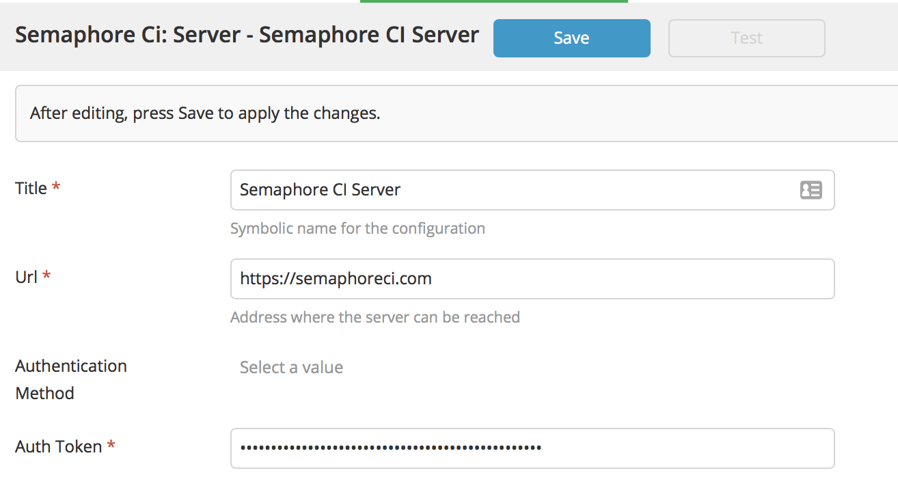
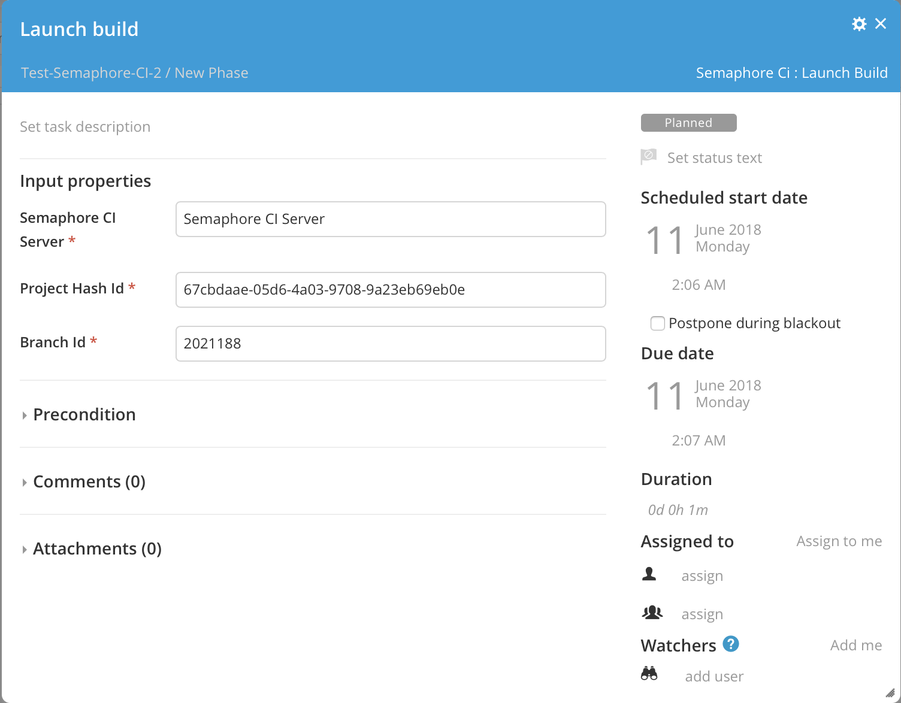

# XL Release Semaphore CI plugin

[![Build Status][xlr-semaphore-ci-plugin-travis-image]][xlr-semaphore-ci-plugin-travis-url]
[![License: MIT][xlr-semaphore-ci-plugin-license-image]][xlr-semaphore-ci-plugin-license-url]
![Github All Releases][xlr-semaphore-ci-plugin-downloads-image]

[xlr-semaphore-ci-plugin-travis-image]: https://travis-ci.org/xebialabs-community/xlr-semaphore-ci-plugin.svg?branch=master
[xlr-semaphore-ci-plugin-travis-url]: https://travis-ci.org/xebialabs-community/xlr-semaphore-ci-plugin
[xlr-semaphore-ci-plugin-license-image]: https://img.shields.io/badge/License-MIT-yellow.svg
[xlr-semaphore-ci-plugin-license-url]: https://opensource.org/licenses/MIT
[xlr-semaphore-ci-plugin-downloads-image]: https://img.shields.io/github/downloads/xebialabs-community/xlr-semaphore-ci-plugin/total.svg

## Preface

This document describes the functionality provided by the XL Deploy|Release Description|Interface plugin.

See the [XL Release reference manual](https://docs.xebialabs.com/xl-release) for background information on XL Release and release automation concepts.  

## Overview

Launches a build on the SemaphoreCI platform.

## Requirements

* XL Release 7+

## Installation

* Copy the latest JAR file from the [releases page](https://github.com/xebialabs-community/xlr-semaphore-ci-plugin/releases) into the `XL_RELEASE_SERVER/plugins/__local__` directory.
* Restart the XL Release server.

## Usage

### Configuration

### Launch Build Task

## References

<https://semaphoreci.com>